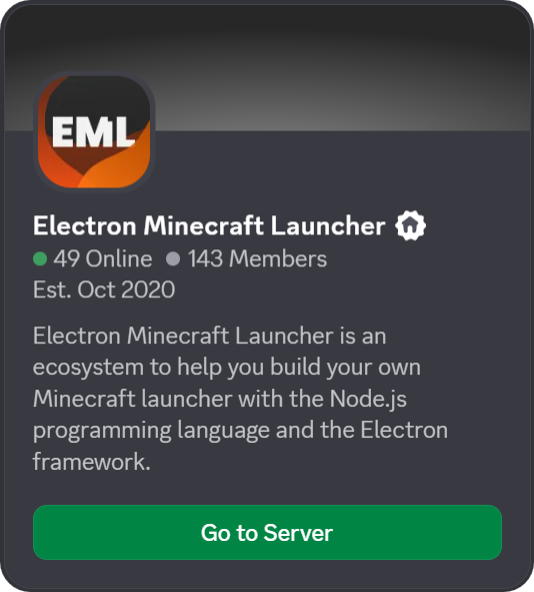

# Electron Minecraft Launcher Lib (EML Lib)

**Electron Minecraft Launcher Lib (EML Lib) is a Node.js library. It permits to authenticate, download Java and Minecraft and launch Minecraft.**

[](https://discord.gg/YVB4k6HzAY)
[](#platforms)
[](package.json)

<p>
<center>
<a href="https://discord.gg/YVB4k6HzAY">
  
</a>
</center>
</p>

---

## Features

### Authentication

EML Lib supports multiple authentication methods, including Microsoft, Azuriom, Yggdrasil and Crack. This allows you to choose the authentication method that best suits your needs and preferences.

_Read the [docs](https://emlproject.pages.dev/docs/authentication)._

### Launch settings

Choose the Minecraft version and loader that you want to launch. EML Lib supports all Minecraft versions, from Minecraft beta to the latest Minecraft snapshot, and all loaders, including Vanilla, Forge, NeoForge, Fabric and Quilt. MCP support is coming soon. <br/>
EML Lib also allows you to use _Profiles_, which are sets of settings (such as Minecraft version, loader, mods, etc.) that you can save and reuse later.

EML Lib can automatically download and install Java to ensure that you have the correct Java version for the Minecraft version you want to launch. It also supports custom Java paths if you prefer to use your own Java installation.

To use all the capacities of EML Lib, you should set up your [EML AdminTool](https://github.com/Electron-Minecraft-Launcher/EML-AdminTool) website. It will allow you to use features such as news, bootstraps, maintenance, background, and more.

_Read the [docs](https://emlproject.pages.dev/docs/launch-settings)._

### Bootstrap [^1]

_Bootstrap_ is a powerful feature that allows you to auto-update your launcher. It checks for updates on a specified URL and downloads and installs them automatically. This ensures that your launcher is always up to date with the latest features and bug fixes.

_Read the [docs](https://emlproject.pages.dev/docs/bootstrap)._

### Maintenance mode [^1]

_Maintenance_ mode is a feature that allows you to block the launcher during maintenance. When maintenance mode is enabled, users will see a message indicating that the launcher is under maintenance and will not be able to launch Minecraft until the maintenance is complete.

_Read the [docs](https://emlproject.pages.dev/docs/maintenance-mode)._

### Customization [^1]

EML Lib allows you to customize the launcher with various features, including:

- **News**: Displaying news on the launcher.
- **Background**: Displaying a background image on the launcher.
- **Server status**: Displaying server information on the launcher.

_Read the [docs](https://emlproject.pages.dev/docs/customization)._

## Comparison with other solutions

There are already several ways to build and distribute a Minecraft launcher or modpack. EML Lib does not aim to replace them entirely, but to solve a different part of the problem: **client-side consistency and control**.

| Solution                            | What it does well                              | Limitations                                                                                   | EML Lib approach                                                      |
| ----------------------------------- | ---------------------------------------------- | --------------------------------------------------------------------------------------------- | --------------------------------------------------------------------- |
| **Packwiz**                         | Modpack definition, reproducible builds        | Requires external launcher or manual integration; players can still drift from expected setup | Enforces the exact state at launch time (no manual client management) |
| **CurseForge / Modrinth launchers** | Easy distribution for players, large ecosystem | No control over client behavior, tied to platform                                             | Full control over launcher behavior and updates                       |
| **Custom scripts / installers**     | Flexible, simple setups                        | Hard to maintain, no real update system                                                       | Built-in update system (Bootstrap) and structured config              |
| **Other launcher libraries**        | Basic Minecraft launching                      | Often limited to launching, little ecosystem around it                                        | Complete ecosystem (authentication, launcher, optional EML AdminTool)     |

### Key difference

Most existing solutions focus on _how to build a modpack_. EML Lib focuses on _how to guarantee that every player runs exactly the expected environment_.

This is especially useful for:

- private servers,
- heavily modded servers,
- controlled environments (no manual client edits).

## Installation

### Software requirements

- Node.js 20 or higher: see [Node.js](https://nodejs.org/);
- Electron 23 or higher: please install it with `npm i electron` _if you use Microsoft Authentication_.

To get all the capacities of this Node.js library, you should set up your [EML AdminTool](https://github.com/Electron-Minecraft-Launcher/EML-AdminTool) website! Without it, some features will be unavailable (such as News, Bootstrap, etc.).

### EML Lib installation

You need [Node.js](https://nodejs.org) and [Electron](https://electronjs.org).

```bash
# Using npm
npm i eml-lib
```

`eml-lib` package includes TypeScript typings, so you don't need to install `@types/eml-lib`.

### Template

You can use the [EML Template](https://github.com/Electron-Minecraft-Launcher/EML-Template) to create a Minecraft launcher with EML Lib. It is an Electron application that uses EML Lib to launch Minecraft. It is a good starting point to create your own Minecraft launcher.

### Quick start

Quick start using the [EML AdminTool](https://github.com/Electron-Minecraft-Launcher/EML-AdminTool):

```js
const EMLLib = require('eml-lib')

const launcher = new EMLLib.Launcher({
  url: 'https://admintool.electron-minecraft-launcher.com',
  serverId: 'eml',
  account: new EMLLib.CrackAuth().auth('GoldFrite')
})

launcher.launch()
```

Please refer to the [docs](https://emlproject.pages.dev/docs/set-up-environment) for more information.

## Platform compatibility

| OS (platform)              | Supported?     | Minimum version supported  |
| -------------------------- | -------------- | -------------------------- |
| Windows (win32)            | Yes            | Windows 7 (Windows NT 6.1) |
| macOS (Darwin)             | Yes            | Mac OS X Lion (10.7)       |
| Linux, including Chrome OS | Yes            | Variable                   |
| Others                     | Not officially | -                          |

> [!WARNING]
> Mac with Apple Silicon (M1, M2, etc.) is supported only for Minecraft 1.13 and above.

> [!WARNING]
> No support will be provided for older versions of Windows, macOS and Linux, or for other operating systems.

## Tests

The library has been tested on Windows 11 and macOS Tahoe (M3) with Node.js 22, on multiple Minecraft versions, from 1.0 to the Minecraft 26.1-snapshot, and with multiple loaders (Vanilla, Forge, NeoForge, Fabric and Quilt).

> [!WARNING]
> Mac with Apple Silicon (M1, M2, etc.) is supported only for Minecraft 1.13 and above.

> [!WARNING]
> Forge is supported only for Minecraft 1.6 and above.

## Contributing

See [CONTRIBUTING.md](./CONTRIBUTING.md) for guidelines on how to contribute to this project.

## Important information

- This is not an official library from Mojang Studios, Microsoft, Electron or Node.js. _Minecraft_ is a trademark of Mojang Studios.
- This Node.js library is under the `MIT` license; to get more information, please read the file `LICENSE`. It is legally obligatory to respect this license.
- If you need some help, you can join [this Discord](https://discord.gg/nfEHKtghPh).

<br/>

[^1]: These features require the use of the [EML AdminTool](https://github.com/Electron-Minecraft-Launcher/EML-AdminTool)
